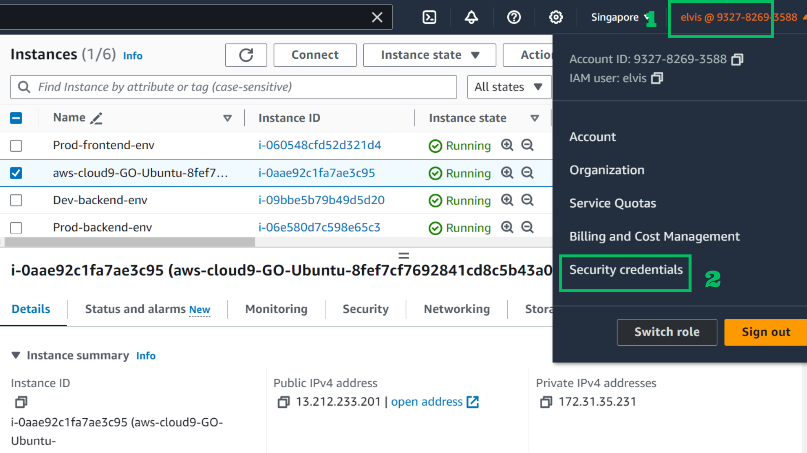
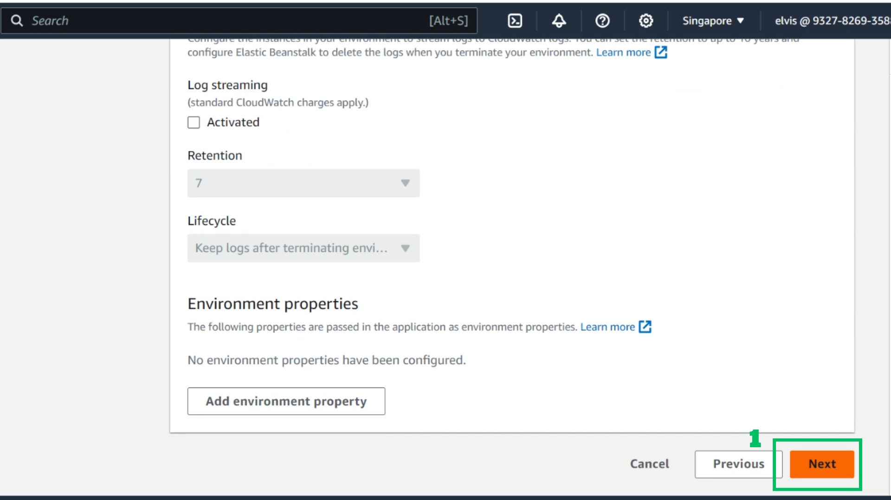

<h1 align="center">DEMO PHASE 1</h1>


<h1 align="center">TABLE OF CONTENTS</h1>


- [1.Introduction](#1introduction)
- [2. Prepare Environment](#2-prepare-environment)
  - [2.1. Create Cloud9 Ubuntu](#21-create-cloud9-ubuntu)
  - [2.2 Github Setup](#22-github-setup)
  - [2.3 Access Key IAM User](#23-access-key-iam-user)
  - [2.4 IAM Role](#24-iam-role)
  - [2.5 Create ECR](#25-create-ecr)
  - [2.6 Setup Elastic Beanstalk](#26-setup-elastic-beanstalk)
- [3. Create mono repo Turbo](#3-create-mono-repo-turbo)
- [4. Build Images Local](#4-build-images-local)
- [5. Setup Github Action](#5-setup-github-action)
- [6. Setup Domain](#6-setup-domain)
- [7. Update Project](#7-update-project)
  - [7.1 Update CI](#71-update-ci)
  - [7.2 Update Environment Flow](#72-update-environment-flow)
  - [7.3 Update Sonarqube Scan](#73-update-sonarqube-scan)
  - [7.4 Update deploy file](#74-update-deploy-file)


## 1.Introduction
- Objectives: 
  - Create a mono repo containing the React application's source code and necessary configuration files.
  - Use AWS Elastic Beanstalk to deploy React applications.
  - Configure auto scaling to automatically adjust the number of instances based on load.
  - Ensure that the application can be deployed automatically through a continuous deployment process (Continuous Deployment).
  - Write detailed documentation on how to set up and deploy the application, including how to use mono repo and configure auto scaling.

## 2. Prepare Environment
### 2.1. Create Cloud9 Ubuntu
1. At AWS Console select Cloud9

<p align="center">
  
</p>

2. At Cloud9 Interface
- Name: GO_Ubuntu
- Choose New EC2 Instance

<p align="center">
  
</p>

3. Scroll down
- Choose Additional Instance types
- Type: t2.medium
- Platform: Ubuntu Server 22.04 LTS
- Timeout: Never

<p align="center">
  
</p>

4. Scroll down
- Choose Create

<p align="center">
  
</p>

5. At EC2 Console
- Choose EC2 aws-cloud9
- Choose Storage

<p align="center">
  
</p>

6. At Storage Interface
- Choose aws-cloud9 volume

<p align="center">
  
</p>

7. Choose Action
- Choose Modify

<p align="center">
  
</p>

8. At Volume Interface
- Size: 100
- Choose Modify

<p align="center">
  
</p>

9. Choose this Instance
- Instance state: Reboot instance

<p align="center">
  
</p>

10. At Cloud9 Ubuntu workspace
- Check Nodejs
- Check Docker
> **Note**: If you use your local environment or any ec2 instances. Prerequisite: Nodejs and Docker are installed.

- Link tutorial Nodejs Install: [How To Install Node.js on Ubuntu 22.04](https://www.digitalocean.com/community/tutorials/how-to-install-node-js-on-ubuntu-22-04 )

- Link tutorial Docker Install: [Install Docker Engine on Ubuntu](https://docs.docker.com/engine/install/ubuntu/ )


<p align="center">
  
</p>

### 2.2 Github Setup 

1. At Github web create a new repository
- Repository name: repo-demo-1
- Choose: Private
- Choose: Create repository


<p align="center">
  
</p>

2. At the Profile 
- Choose Settings


<p align="center">
  
</p>

3. At left bar
- Choose Developer settings


<p align="center">
  
</p>

4. At Developer Settings
- Choose Token(basic)
- Choose Generate new token
- Choose classic


<p align="center">
  
</p>

5. At Token interface
- Note: demo-1-token
- Select repo
- Select workflow


<p align="center">
  
</p>

6. Scroll down
- Choose Generate token

<p align="center">
  
</p>

7. Copy this token and save


<p align="center">
  
</p>

8. At Cloud9 
- Run this command to enable save token
```sh
git config --global credential.helper store

```
- Clone repository
```sh
git clone https://<USERNAME>:<PAT>@github.com/<USERNAME>/<REPO>.git
```


<p align="center">
  
</p>

9. Create dev and prod stage
```sh
git checkout main
git checkout -b dev

git checkout main
git checkout -b prod
```


<p align="center">
  
</p>

10. Push code to stage dev

```sh
git checkout dev
git add .
git commit -m "dev"
git push --set-upstream ogirin dev
```


<p align="center">
  
</p>

11. Push code to stage prod

```sh
git checkout prod
git add .
git commit -m "prod"
git push --set-upstream ogirin prod
```
<p align="center">
  
</p>

### 2.3 Access Key IAM User

1. At AWS 
- Choose profile
- Choose Security Credentials
<p align="center">
  
</p>

2. Scroll down 
- Choose Create access key
<p align="center">
  
</p>

3. Choose CLI

<p align="center">
  
</p>

4. Choose I understand and Next
<p align="center">
  
</p>

5. Choose Create access key

<p align="center">
  
</p>

6. Save key
<p align="center">
  
</p>


### 2.4 IAM Role 
1. At AWS Console
- Choose IAM

<p align="center">
  
</p>

2. At Role interface 
- Choose aws-elasticbeanstalk-service-role

<p align="center">
  
</p>

3. Choose Attach Policies
- Then add necessary Policies:
AmazonEC2ContainerRegistryFullAccess
AmazonEC2ContainerRegistryPowerUser
AWSElasticBeanstalkEnhancedHealth
AWSElasticBeanstalkManagedUpdatesCustomerRolePolicy
AWSElasticBeanstalkService

<p align="center">
  
</p>

4. At Role interface 
- Choose aws-elasticbeanstalk-ec2-role

<p align="center">
  
</p>

5. Choose Attach Policies
- Then add necessary Policies:
AmazonEC2ContainerRegistryFullAccess
AmazonEC2ContainerRegistryReadOnly
AWSElasticBeanstalkMulticontainerDocker
AWSElasticBeanstalkWebTier
AWSElasticBeanstalkWorkerTier

<p align="center">
  
</p>

### 2.5 Create ECR 

1. At AWS Console
- Choose ECR

<p align="center">
  
</p>

2. At ECR interface
- Choose Create

<p align="center">
  
</p>

3. At repository interface
- Repository name: repo-demo-1-fe

<p align="center">
  
</p>

4. Scroll down
- Choose Create

<p align="center">
  
</p>

5. At repository interface
- Repository name: repo-demo-1-be

<p align="center">
  
</p>

6. Scroll down
- Choose Create

<p align="center">
  
</p>

7. View push command frontend
<p align="center">
  
</p>

8. Check and use it to push images
<p align="center">
  
</p>

9. View push command backend
<p align="center">
  
</p>

10. Check and use it to push images
<p align="center">
  
</p>

### 2.6 Setup Elastic Beanstalk
1. At AWS Console
- Choose Elastic Beanstalk

<p align="center">
  
</p>

2. At EB interface
- Choose Environment
- Choose Create environment

<p align="center">
  
</p>

3. At environment interface
- Application name: dev-frontend

<p align="center">
  
</p>

4. Scroll down
- Domain: dev-frontend

<p align="center">
  
</p>

5. Scroll down
- Platform: Docker

<p align="center">
  
</p>

6. Scroll down
- Choose High available
- Choose Next

<p align="center">
  
</p>

7. Next page
- Choose Use an existing service role
- Choose Next

<p align="center">
  
</p>

8. Next Page
- Choose VPC Default

<p align="center">
  
</p>

9. Scroll down
- Choose Activated IP
- Choose Instance subnets

<p align="center">
  
</p>

10. Scroll down
- Choose Next

<p align="center">
  
</p>

11. Next Page 
- Choose Load balanced
- Instances : 1 - 4

<p align="center">
  
</p>

12. Scroll down
- Choose Next

<p align="center">
  
</p>

13. Scroll down
- Deployment policy: All at one
- Batch size type: Fixed

<p align="center">
  
</p>

14. Scroll down
- Choose Submit

<p align="center">
  
</p>

15. Check on browser 
- Copy and paste domain

<p align="center">
  
</p>

16. Similar with 3 elastic beanstalk 
- Name: dev-backend
- Name: prod-frontend
- Name: prod-backend


## 3. Create mono repo Turbo
1. At Cloud9
- Go to path /repo-demo-1
- Branch dev
- Run command
```sh
npx create turbo@latest
```
- Choose -y

<p align="center">
  
</p>

2. Choose locate here ./
- Choose npm

<p align="center">
  
</p>

3. Make directory frontend and backend
```sh
mkdir apps/frontend
mkdir apps/backend
```

<p align="center">
  
</p>

4. Create frontend app
```sh
npx create-react-app apps/frontend

```

<p align="center">
  
</p>

5. Create backend app
```sh
npx @nestjs/cli new apps/backend
```

<p align="center">
  
</p>

6. All choose npm
<p align="center">
  
</p>

## 4. Build Images Local
1. Prepare Dockerfile
- Frontend
```sh

# Stage 1: Build the React app
FROM node:17.1-alpine AS build-stage

WORKDIR /app

# Install turbo globally
RUN npm install -g turbo
COPY . .
RUN turbo prune --scope=frontend --docker
# Copy the root package.json and yarn.lock
COPY package*.json ./

# Copy the frontend package.json
COPY apps/frontend/package.json ./apps/frontend/package.json

# Install dependencies
RUN npm install

# Copy the rest of the project files_
COPY . .

# Build the frontend app
RUN npx turbo run build --filter=frontend

# Stage 2: Serve the app with Nginx
FROM nginx:latest AS prod-stage

# Copy the build output to replace the default Nginx contents
COPY --from=build-stage /app/apps/frontend/build /usr/share/nginx/html

EXPOSE 80

CMD ["nginx", "-g", "daemon off;"]

```
- Backend
```sh
# BUILD 
FROM node:18-alpine As build

# Create app directory
WORKDIR /app

RUN npm install -g turbo

COPY . .
# Copy the root package.json
COPY package*.json ./

RUN npm install

RUN turbo prune --scope=backend --docker


RUN turbo run build --filter=backend
# # Set NODE_ENV environment variable

ENV NODE_ENV production
# # Running `npm ci` removes the existing node_modules directory and passing in --only=production ensures that only the production dependencies are installed. This ensures that the node_modules directory is as optimized as possible
RUN npm ci --only=production && npm cache clean --force

# PRODUCTION
FROM node:18-alpine As production
WORKDIR /app

# Copy the bundled code from the build stage to the production image
COPY  --from=build /app/apps/backend/dist ./dist
COPY --from=build /app/node_modules ./node_modules

# Start the server using the production build
CMD [ "node", "dist/main.js" ]

```
2. Build frontend

<p align="center">
  
</p>

3. Build Backend
<p align="center">
  
</p>

4. Check images
<p align="center">
  
</p>

5. Run containers
<p align="center">
  
</p>

6. Check containers
<p align="center">
  
</p>

7. Choose aws-cloud9 ec2
- Choose Security

<p align="center">
  
</p>

8. At Security interface
- Choose aws-cloud9 security

<p align="center">
  
</p>

9. Choose Edit inbound rules
<p align="center">
  
</p>

10. Add rules
- Rule : 3000 | 0.0.0.0/0
- Rule : 8080 | 0.0.0.0/0
- Choose Save rules

<p align="center">
  
</p>

11. Check on browser
- Backend: 

<p align="center">
  
</p>

12. Check on browser
- Frontend: 

<p align="center">
  
</p>


## 5. Setup Github Action

1. Create folder and deploy file
```sh
mkdir -p .github/workflows
cd .github/workflows
touch dev_deploy.yaml
touch prod_deploy.yaml
```
- Deploy Dev
```sh
# dev_deploy.yaml
name: Deploy Dev
on:
  push:
    branches:
    - dev
jobs:
  build:
    runs-on: ubuntu-latest
    steps:

    - name: Checkout source code
      uses: actions/checkout@v2

    - name: Generate deployment package for React app
      run: |
        cd apps/frontend
        zip -r ../../frontend_deploy.zip Dockerrun.aws.json
        cd ../..
        
        
    - name: Prepare and Zip NestJS app for deployment
      run: |
        cd apps/backend
        zip -r ../../backend_deploy.zip Dockerrun.aws.json
        cd ../..  

    - name: Deploy React app to EB
      uses: einaregilsson/beanstalk-deploy@v22
      with:
        aws_access_key: ${{ secrets.AWS_ACCESS_KEY_ID }}
        aws_secret_key: ${{ secrets.AWS_SECRET_ACCESS_KEY }}
        application_name: dev-frontend
        environment_name: Dev-frontend-env
        version_label: react-${{ github.run_id }}
        region: ap-southeast-1
        deployment_package: frontend_deploy.zip
  
    - name: Deploy NestJS app to EB
      uses: einaregilsson/beanstalk-deploy@v22
      with:
        aws_access_key: ${{ secrets.AWS_ACCESS_KEY_ID }}
        aws_secret_key: ${{ secrets.AWS_SECRET_ACCESS_KEY }}
        application_name: dev-backend
        environment_name: Dev-backend-env
        version_label: nest-${{ github.run_id }}
        region: ap-southeast-1
        deployment_package: backend_deploy.zip
```

- Deploy Prod
```sh
# prod_deploy.yaml
name: Deploy Prod
on:
  push:
    branches:
    - prod
jobs:
  build:
    runs-on: ubuntu-latest
    steps:

    - name: Checkout source code
      uses: actions/checkout@v2

    - name: Generate deployment package for React app
      run: |
        cd apps/frontend
        zip -r ../../frontend_deploy.zip Dockerrun.aws.json
        cd ../..
        
        
    - name: Prepare and Zip NestJS app for deployment
      run: |
        cd apps/backend
        zip -r ../../backend_deploy.zip Dockerrun.aws.json
        cd ../..   

    - name: Deploy React app to EB
      uses: einaregilsson/beanstalk-deploy@v22
      with:
        aws_access_key: ${{ secrets.AWS_ACCESS_KEY_ID }}
        aws_secret_key: ${{ secrets.AWS_SECRET_ACCESS_KEY }}
        application_name: prod-frontend
        environment_name: Prod-frontend-env
        version_label: react-${{ github.run_id }}
        region: ap-southeast-1
        deployment_package: frontend_deploy.zip
  
    - name: Deploy NestJS app to EB
      uses: einaregilsson/beanstalk-deploy@v22
      with:
        aws_access_key: ${{ secrets.AWS_ACCESS_KEY_ID }}
        aws_secret_key: ${{ secrets.AWS_SECRET_ACCESS_KEY }}
        application_name: prod-backend
        environment_name: Prod-backend-env
        version_label: nest-${{ github.run_id }}
        region: ap-southeast-1
        deployment_package: backend_deploy.zip
```


2. At repository
- Choose Settings
- Choose Actions Secrest and variables
- Choose Create new

<p align="center">
  
</p>

3. Actions secrets
- Name: AWS_ACCESS_KEY_ID
- Secret: {}
- Choose Add secret

<p align="center">
  
</p>

4. Actions secrets
- Name: AWS_SECRET_ACCESS_KEY
- Secret: {}
- Choose Add secret
<p align="center">
  
</p>

5. Push code and deploy dev
<p align="center">
  
</p>

6. Check deploy success
<p align="center">
  
</p>

7. Check health ok
- Copy domain

<p align="center">
  
</p>

8. Check on browser frontend
<p align="center">
  
</p>

9. Check on browser backend
<p align="center">
  
</p>

10. Similar with prod
<p align="center">
  
</p>

11. Check on browser frontend
<p align="center">
  
</p>

12. Check on browser backend
<p align="center">
  
</p>

## 6. Setup Domain
1. Use cloudflare for domain
- Choose Add record
- Type: CNAME
- Name: {name-eb}
- Content: {domain-eb}

<p align="center">
  
</p>

2. Similar and check success
<p align="center">
  
</p>

3. Choose SSL/TLS
- Choose Edge Certificates
- Scroll down
- Enable Always Use HTTPS

<p align="center">
  
</p>

4. Check domain dev-frontend on browsers
<p align="center">
  
</p>

5. Check domain dev-backend on browsers
<p align="center">
  
</p>

6. Check domain prod-frontend on browsers
<p align="center">
  
</p>

7. Check domain dev-backend on browsers
<p align="center">
  
</p>


## 7. Update Project
### 7.1 Update CI
1. Update Code Build Images Automation - Dev Deployfile
```sh
name: Deploy Dev
on:
  push:
    branches:
      - dev
    paths:
      - 'apps/frontend/**'
      - 'apps/backend/**'
      - '!images/**'
      - '!readme.md'

jobs:
  build:
    runs-on: ubuntu-latest
    env:
      AWS_REGION: ${{ secrets.AWS_REGION }}
      ECR_REGISTRY: ${{ secrets.AWS_ACCOUNT_ID }}.dkr.ecr.${{ secrets.AWS_REGION }}.amazonaws.com
      ECR_REPOSITORY_FRONTEND: repo-demo-1-fe
      ECR_REPOSITORY_BACKEND: repo-demo-1-be

      DEV_APPLICATION_FRONTEND_EB: ${{ vars.DEV_APPLICATION_FRONTEND_EB }}
      DEV_ENV_FRONTEND_EB: ${{ vars.DEV_ENV_FRONTEND_EB }}
      DEV_APPLICATION_BACKEND_EB: ${{ vars.DEV_APPLICATION_BACKEND_EB }}
      DEV_ENV_BACKEND_EB: ${{ vars.DEV_ENV_BACKEND_EB }}

      API: ${{ secrets.API }}

    steps:
      - uses: actions/checkout@v4
        with:
          fetch-depth: 0  # Shallow clones should be disabled for a better relevancy of analysis
      - uses: sonarsource/sonarqube-scan-action@master
        env:
          SONAR_TOKEN: ${{ secrets.SONAR_TOKEN }}
          SONAR_HOST_URL: ${{ secrets.SONAR_HOST_URL }}

      - name: Configure AWS credentials
        uses: aws-actions/configure-aws-credentials@0e613a0980cbf65ed5b322eb7a1e075d28913a83
        with:
          aws-access-key-id: ${{ secrets.AWS_ACCESS_KEY_ID }}
          aws-secret-access-key: ${{ secrets.AWS_SECRET_ACCESS_KEY }}
          aws-region: ${{ env.AWS_REGION }}

      - name: Login to Amazon ECR
        id: login-ecr
        uses: aws-actions/amazon-ecr-login@62f4f872db3836360b72999f4b87f1ff13310f3a


      # Build and push frontend image
      - name: Build and push Docker image for frontend
        if: contains(toJSON(github.event.commits), 'apps/frontend')
        run: |
          docker build -f frontend_Dockerfile -t ${{ env.ECR_REGISTRY }}/${{ env.ECR_REPOSITORY_FRONTEND }}:latest .
          docker tag ${{ env.ECR_REGISTRY }}/${{ env.ECR_REPOSITORY_FRONTEND }}:latest ${{ env.ECR_REGISTRY }}/${{ env.ECR_REPOSITORY_FRONTEND }}:${{ github.sha }}
          docker push ${{ env.ECR_REGISTRY }}/${{ env.ECR_REPOSITORY_FRONTEND }}:latest
          docker push ${{ env.ECR_REGISTRY }}/${{ env.ECR_REPOSITORY_FRONTEND }}:${{ github.sha }}
          sed -i 's|"Name": ".*"|"Name": "'${{ env.ECR_REGISTRY }}/${{ env.ECR_REPOSITORY_FRONTEND }}:${{ github.sha }}'"|' apps/frontend/Dockerrun.aws.json

      # Build and push backend image
      - name: Build and push Docker image for backend
        if: contains(toJSON(github.event.commits), 'apps/backend')
        run: |
          docker build -f backend_Dockerfile -t ${{ env.ECR_REGISTRY }}/${{ env.ECR_REPOSITORY_BACKEND }}:latest .
          docker tag ${{ env.ECR_REGISTRY }}/${{ env.ECR_REPOSITORY_BACKEND }}:latest ${{ env.ECR_REGISTRY }}/${{ env.ECR_REPOSITORY_BACKEND }}:${{ github.sha }}
          docker push ${{ env.ECR_REGISTRY }}/${{ env.ECR_REPOSITORY_BACKEND }}:latest
          docker push ${{ env.ECR_REGISTRY }}/${{ env.ECR_REPOSITORY_BACKEND }}:${{ github.sha }}
          sed -i 's|"Name": ".*"|"Name": "'${{ env.ECR_REGISTRY }}/${{ env.ECR_REPOSITORY_BACKEND }}:${{ github.sha }}'"|' apps/backend/Dockerrun.aws.json


      - name: Generate deployment package for React app
        if: contains(toJSON(github.event.commits), 'apps/frontend')
        run: |
          cd apps/frontend
          sed -i 's|__API__|'"${{ env.API }}"'|g' .ebextensions/01-environment.config
          zip -r ../../frontend_deploy.zip Dockerrun.aws.json .ebextensions
          cd ../..

      - name: Prepare and Zip NestJS app for deployment
        if: contains(toJSON(github.event.commits), 'apps/backend')
        run: |
          cd apps/backend
          sed -i 's|__API__|'"${{ env.API }}"'|g' .ebextensions/01-environment.config
          zip -r ../../backend_deploy.zip Dockerrun.aws.json .ebextensions
          cd ../..

      - name: Deploy React app to EB
        if: contains(toJSON(github.event.commits), 'apps/frontend')
        uses: einaregilsson/beanstalk-deploy@v22
        with:
          aws_access_key: ${{ secrets.AWS_ACCESS_KEY_ID }}
          aws_secret_key: ${{ secrets.AWS_SECRET_ACCESS_KEY }}
          application_name: ${{ env.DEV_APPLICATION_FRONTEND_EB }}
          environment_name: ${{ env.DEV_ENV_FRONTEND_EB }}
          version_label: react-${{ github.run_id }}
          region: ap-southeast-1
          deployment_package: frontend_deploy.zip

      - name: Deploy NestJS app to EB
        if: contains(toJSON(github.event.commits), 'apps/backend')
        uses: einaregilsson/beanstalk-deploy@v22
        with:
          aws_access_key: ${{ secrets.AWS_ACCESS_KEY_ID }}
          aws_secret_key: ${{ secrets.AWS_SECRET_ACCESS_KEY }}
          application_name: ${{ env.DEV_APPLICATION_BACKEND_EB }}
          environment_name: ${{ env.DEV_ENV_BACKEND_EB }}
          version_label: nest-${{ github.run_id }}
          region: ap-southeast-1
          deployment_package: backend_deploy.zip

```
2. Update Code Build Images Automation - Prod Deployfile
```sh
name: Deploy Dev
on:
  push:
    branches:
      - main
    paths:
      - 'apps/frontend/**'
      - 'apps/backend/**'
      - '!images/**'
      - '!readme.md'


jobs:
  build:
    runs-on: ubuntu-latest
    env:
      AWS_REGION: ${{ secrets.AWS_REGION }}
      ECR_REGISTRY: ${{ secrets.AWS_ACCOUNT_ID }}.dkr.ecr.${{ secrets.AWS_REGION }}.amazonaws.com
      ECR_REPOSITORY_FRONTEND: repo-demo-1-fe
      ECR_REPOSITORY_BACKEND: repo-demo-1-be

      PROD_APPLICATION_FRONTEND_EB: ${{ vars.PROD_APPLICATION_FRONTEND_EB }}
      PROD_ENV_FRONTEND_EB: ${{ vars.PROD_ENV_FRONTEND_EB }}
      PROD_APPLICATION_BACKEND_EB: ${{ vars.PROD_APPLICATION_BACKEND_EB }}
      PROD_ENV_BACKEND_EB: ${{ vars.PROD_ENV_BACKEND_EB }}


      API: ${{ secrets.API }}

    steps:

      - uses: actions/checkout@v4
        with:
          fetch-depth: 0  # Shallow clones should be disabled for a better relevancy of analysis
      - name: Change name repository sonarqube

        run: |

          sed -i 's|Sonar-Demo-1|Sonar-Demo-1-Prod|g' sonar-project.properties

      - uses: sonarsource/sonarqube-scan-action@master
        env:
          SONAR_TOKEN: ${{ secrets.SONAR_TOKEN_PROD }}
          SONAR_HOST_URL: ${{ secrets.SONAR_HOST_URL }}


      - name: Configure AWS credentials
        uses: aws-actions/configure-aws-credentials@0e613a0980cbf65ed5b322eb7a1e075d28913a83
        with:
          aws-access-key-id: ${{ secrets.AWS_ACCESS_KEY_ID }}
          aws-secret-access-key: ${{ secrets.AWS_SECRET_ACCESS_KEY }}
          aws-region: ${{ env.AWS_REGION }}

      - name: Login to Amazon ECR
        id: login-ecr
        uses: aws-actions/amazon-ecr-login@62f4f872db3836360b72999f4b87f1ff13310f3a


        # Build and push frontend image
      - name: Build and push Docker image for frontend
        if: contains(toJSON(github.event.commits), 'apps/frontend')
        run: |
          docker build -f frontend_Dockerfile -t ${{ env.ECR_REGISTRY }}/${{ env.ECR_REPOSITORY_FRONTEND }}:latest .
          docker tag ${{ env.ECR_REGISTRY }}/${{ env.ECR_REPOSITORY_FRONTEND }}:latest ${{ env.ECR_REGISTRY }}/${{ env.ECR_REPOSITORY_FRONTEND }}:${{ github.sha }}
          docker push ${{ env.ECR_REGISTRY }}/${{ env.ECR_REPOSITORY_FRONTEND }}:latest
          docker push ${{ env.ECR_REGISTRY }}/${{ env.ECR_REPOSITORY_FRONTEND }}:${{ github.sha }}
          sed -i 's|"Name": ".*"|"Name": "'${{ env.ECR_REGISTRY }}/${{ env.ECR_REPOSITORY_FRONTEND }}:${{ github.sha }}'"|' apps/frontend/Dockerrun.aws.json

      # Build and push backend image
      - name: Build and push Docker image for backend
        if: contains(toJSON(github.event.commits), 'apps/backend')
        run: |
          docker build -f backend_Dockerfile -t ${{ env.ECR_REGISTRY }}/${{ env.ECR_REPOSITORY_BACKEND }}:latest .
          docker tag ${{ env.ECR_REGISTRY }}/${{ env.ECR_REPOSITORY_BACKEND }}:latest ${{ env.ECR_REGISTRY }}/${{ env.ECR_REPOSITORY_BACKEND }}:${{ github.sha }}
          docker push ${{ env.ECR_REGISTRY }}/${{ env.ECR_REPOSITORY_BACKEND }}:latest
          docker push ${{ env.ECR_REGISTRY }}/${{ env.ECR_REPOSITORY_BACKEND }}:${{ github.sha }}
          sed -i 's|"Name": ".*"|"Name": "'${{ env.ECR_REGISTRY }}/${{ env.ECR_REPOSITORY_BACKEND }}:${{ github.sha }}'"|' apps/backend/Dockerrun.aws.json


      - name: Generate deployment package for React app
        if: contains(toJSON(github.event.commits), 'apps/frontend')
        run: |
          cd apps/frontend
          sed -i 's|__API__|'"${{ env.API }}"'|g' .ebextensions/01-environment.config
          zip -r ../../frontend_deploy.zip Dockerrun.aws.json .ebextensions
          cd ../..

      - name: Prepare and Zip NestJS app for deployment
        if: contains(toJSON(github.event.commits), 'apps/backend')
        run: |
          cd apps/backend
          sed -i 's|__API__|'"${{ env.API }}"'|g' .ebextensions/01-environment.config
          zip -r ../../backend_deploy.zip Dockerrun.aws.json .ebextensions
          cd ../..

      - name: Deploy React app to EB
        if: contains(toJSON(github.event.commits), 'apps/frontend')
        uses: einaregilsson/beanstalk-deploy@v22
        with:
          aws_access_key: ${{ secrets.AWS_ACCESS_KEY_ID }}
          aws_secret_key: ${{ secrets.AWS_SECRET_ACCESS_KEY }}
          application_name: ${{ env.PROD_APPLICATION_FRONTEND_EB }}
          environment_name: ${{ env.PROD_ENV_FRONTEND_EB }}
          version_label: react-${{ github.run_id }}
          region: ap-southeast-1
          deployment_package: frontend_deploy.zip

      - name: Deploy NestJS app to EB
        if: contains(toJSON(github.event.commits), 'apps/backend')
        uses: einaregilsson/beanstalk-deploy@v22
        with:
          aws_access_key: ${{ secrets.AWS_ACCESS_KEY_ID }}
          aws_secret_key: ${{ secrets.AWS_SECRET_ACCESS_KEY }}
          application_name: ${{ env.PROD_APPLICATION_BACKEND_EB }}
          environment_name: ${{ env.PROD_ENV_BACKEND_EB }}
          version_label: nest-${{ github.run_id }}
          region: ap-southeast-1
          deployment_package: backend_deploy.zip

```

3. Update Code for backend /src/main.ts
```sh
import { NestFactory } from '@nestjs/core';
import { AppModule } from './app.module';
import * as dotenv from 'dotenv';
import { ConfigService } from '@nestjs/config';

dotenv.config();
async function bootstrap() {
  const app = await NestFactory.create(AppModule);
  const configService = app.get(ConfigService);
  const api = configService.get<string>('API');
  // const api = process.env.API;
  if (!api) {
    console.error('API environment variable is not set!');
  } else {
    console.log(`API environment variable is set to: ${api}`);
  }

  await app.listen(3000, () => {
    console.log(`V11 upload dotenv This is my API: ${api}`)
  });


}
bootstrap();

```
4. Update Code for backend /src/app.service.ts
```sh
import { Injectable } from '@nestjs/common';
import { ConfigService } from '@nestjs/config';

@Injectable()
export class AppService {
  constructor(private configService: ConfigService) {}

  getHello(): string {
    const api = this.configService.get<string>('API');
    return `Hello World! V2 API: ${api}`;
  }
}

```

5. Update Code for backend /src/app.service.ts
```sh
import { Module } from '@nestjs/common';
import { AppController } from './app.controller';
import { AppService } from './app.service';

import { ConfigModule } from '@nestjs/config';

@Module({
  imports: [
    ConfigModule.forRoot({
      isGlobal: true, // Đặt module này là global để tất cả các module khác đều có thể sử dụng
      envFilePath: '.env', // Đường dẫn tới tệp .env của bạn
    }),
  ],
  controllers: [AppController],
  providers: [AppService],
})

export class AppModule {}

```
6. Use npm install necessary package
```sh
npm install dotenv
npm install @nestjs/config
```

### 7.2 Update Environment Flow
1. Setup Secrets and Variables for Github Action

2. Setup .ebextensions/01-environment.config for backend and frontend
### 7.3 Update Sonarqube Scan
1. Launch a Instance EC2 Ubuntu
2. Install Docker
3. Run docker compose 
```sh
version: "3"

services:
  sonarqube:
    image: sonarqube:community
    depends_on:
      - db
    environment:
      SONAR_JDBC_URL: jdbc:postgresql://db:5432/sonar
      SONAR_JDBC_USERNAME: sonar
      SONAR_JDBC_PASSWORD: sonar
    volumes:
      - sonarqube_data:/opt/sonarqube/data
      - sonarqube_extensions:/opt/sonarqube/extensions
      - sonarqube_logs:/opt/sonarqube/logs
    ports:
      - "9000:9000"
  db:
    image: postgres:12
    environment:
      POSTGRES_USER: sonar
      POSTGRES_PASSWORD: sonar
    volumes:
      - postgresql:/var/lib/postgresql
      - postgresql_data:/var/lib/postgresql/data

volumes:
  sonarqube_data:
  sonarqube_extensions:
  sonarqube_logs:
  postgresql:
  postgresql_data:
```
4. Setup Nginx for Sonarqube
```sh
server {
  server_name sonar.hoangguruu.id.vn;
    location / {
        proxy_pass http://localhost:9000;
        proxy_http_version 1.1;
        proxy_set_header Upgrade $http_upgrade;
        proxy_set_header Connection 'upgrade';
        proxy_set_header Host $host;
        proxy_cache_bypass $http_upgrade;
    }
}
```
5. Create new project and add API Token
### 7.4 Update deploy file

```sh
####### Update use github.ref
      - name: Deploy React app to EB (Dev or Prod)
        if: contains(toJSON(github.event.commits), 'apps/frontend')
        uses: einaregilsson/beanstalk-deploy@v22
        with:
          aws_access_key: ${{ secrets.AWS_ACCESS_KEY_ID }}
          aws_secret_key: ${{ secrets.AWS_SECRET_ACCESS_KEY }}
          application_name: ${{ github.ref == 'refs/heads/dev' && env.DEV_APPLICATION_FRONTEND_EB || env.PROD_APPLICATION_FRONTEND_EB }}
          environment_name: ${{ github.ref == 'refs/heads/dev' && env.DEV_ENV_FRONTEND_EB || env.PROD_ENV_FRONTEND_EB }}
          version_label: react-${{ github.run_id }}
          region: ap-southeast-1
          deployment_package: frontend_deploy.zip

      - name: Deploy NestJS app to EB (Dev or Prod)
        if: contains(toJSON(github.event.commits), 'apps/backend')
        uses: einaregilsson/beanstalk-deploy@v22
        with:
          aws_access_key: ${{ secrets.AWS_ACCESS_KEY_ID }}
          aws_secret_key: ${{ secrets.AWS_SECRET_ACCESS_KEY }}
          application_name: ${{ github.ref == 'refs/heads/dev' && env.DEV_APPLICATION_BACKEND_EB || env.PROD_APPLICATION_BACKEND_EB }}
          environment_name: ${{ github.ref == 'refs/heads/dev' && env.DEV_ENV_BACKEND_EB || env.PROD_ENV_BACKEND_EB }}
          version_label: nest-${{ github.run_id }}
          region: ap-southeast-1
          deployment_package: backend_deploy.zip

```


<!-- @import "[TOC]" {cmd="toc" depthFrom=1 depthTo=6 orderedList=false} -->

<!-- code_chunk_output -->

- [1.Introduction](#1introduction)
- [2. Prepare Environment](#2-prepare-environment)
  - [2.1. Create Cloud9 Ubuntu](#21-create-cloud9-ubuntu)
  - [2.2 Github Setup](#22-github-setup)
  - [2.3 Access Key IAM User](#23-access-key-iam-user)
  - [2.4 IAM Role](#24-iam-role)
  - [2.5 Create ECR](#25-create-ecr)
  - [2.6 Setup Elastic Beanstalk](#26-setup-elastic-beanstalk)
- [3. Create mono repo Turbo](#3-create-mono-repo-turbo)
- [4. Build Images Local](#4-build-images-local)
- [5. Setup Github Action](#5-setup-github-action)
- [6. Setup Domain](#6-setup-domain)
- [7. Update Project](#7-update-project)
  - [7.1 Update CI](#71-update-ci)
  - [7.2 Update Environment Flow](#72-update-environment-flow)
  - [7.3 Update Sonarqube Scan](#73-update-sonarqube-scan)
  - [7.4 Update deploy file](#74-update-deploy-file)

<!-- /code_chunk_output -->


